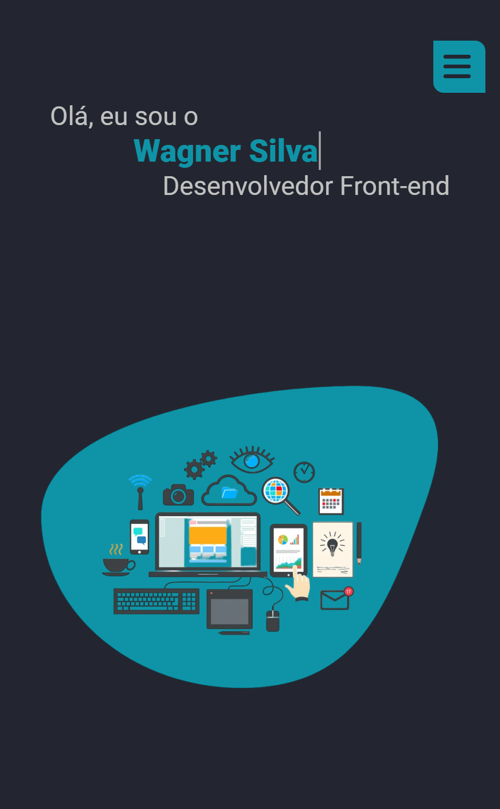
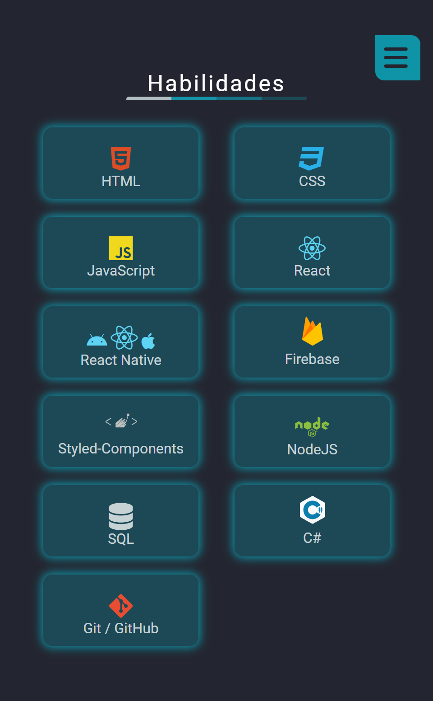
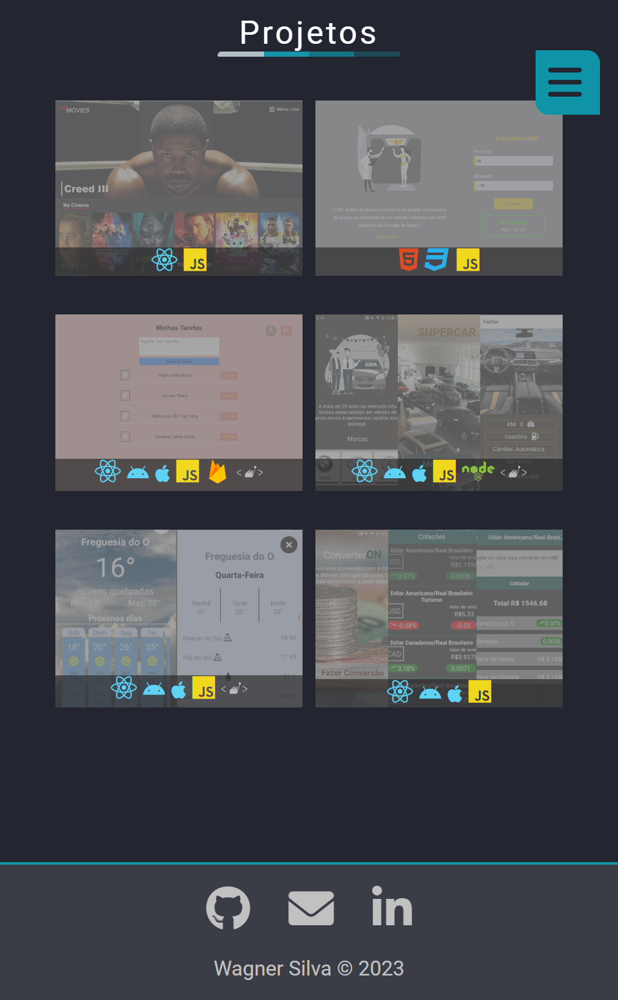

<h1 align="center">Meu Portfólio</h1>
 

<a href="https://wagnersilva-portfolio.netlify.app" target="_blank">Link Deploy🔗</a>
  
## Layout 💻
  

## Mobile 📱

 

 

## Tecnologias utilizadas 👨🏻‍💻

- HTML
- CSS
- JavaScript

